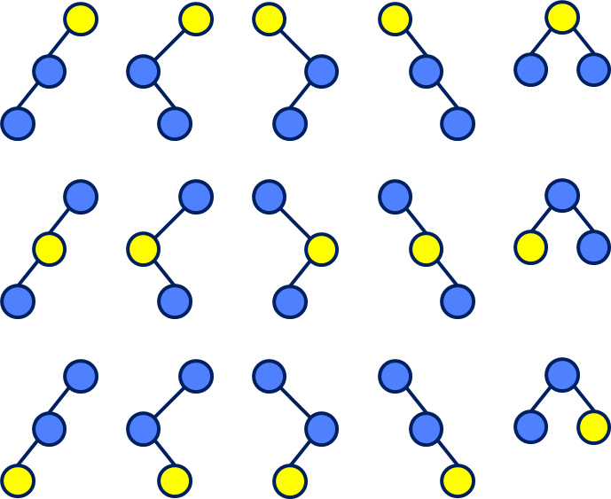

# Binary trees

## Description

Dido and Boyko are known musicians who have recently developed interest in informatics and are very excited about tree-like data structures, combinatorics and algorithms, balanced trees, unbalanced trees, binary trees, ternary trees, all kinds of trees, different type of wood and ikeban, woodworking and lumberjack industry.
Once as they were writing a new song about trees, grass, tree frogs and the meaning of life, they had this intellectual idea:
* If they have a bucket of colored balls, how many binary trees can be build with them
* Example: they have a bucket of 1 yellow and 2 blue balls. They can make 15 unique binary trees

The task turned out to be difficult, and though both musicians have studied mathematics at the Technical University, the could not devise a formula by which to calculate how many different binary trees can be built from multiple colored balls by putting a ball in each node.
Help Dido and Boyko by writing a program that does the calculation.
Note that:
* balls of the same color are indistinguishable from one another
* the root of the trees is always on top
* the leaves are always on the bottom
* there is a difference between left and right successor

## Input

* Input is read from the console
* One line consisted of upper-case latin letters
  * Each letter represents a color
  * The balls are as many as the letters

## Output

* Output should be printed on the console
* Output the number of unique binary trees

## Constraints

* The number of balls is **between 1 and 20 inclusive**
* The number of different colors is **between 1 and 20 inclusive**
* Time limit: **0.1 seconds**
* Memory limit: **64MiB**

## Examples

### Example 1

#### Input
```
YBB
```

#### Output
```
15
```

### Example 2

#### Input
```
YYYBBRBBB
```

#### Output
```
2450448
```
