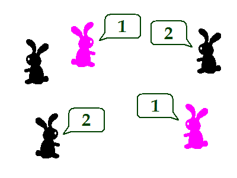

# Rabbits

## Description
Cat Sid visited a town of rabits and asked **some of the rabbits** the following question: *"How many rabbits in this town other than yourself have the same color as you?"*. The rabbits all replied truthfully, and no rabbits was asked the question more than once.

You are given the rabbits' replies on the first console line.

Write a program to find the minimum possible number of rabbits in this town.

## Input
Input is read from the console.

On the first input line there will be the list of rabbits' replies separated by a single space (' ') and ending with `-1`.

## Output
Output should be printed to the console.

Print the minimum possible number of rabbits in this town.

## Constraints
* The number of replies will be between 1 and 50, inclusive.
* Each reply will be an integer number between 0 and 1,000,000, inclusive.
* Time limit: **0.1 seconds**
* Memory limit: **16 MB**

## Examples

| Input                     | Output | Description                                      |
| ------------------------- | ------ | ------------------------------------------------ |
| `1 1 2 2 -1`              | `5`    | If there are 2 rabbits with a color and 3 rabbits with another color, Pochi can get this set of replies. See the image above. |
| `0 -1`                    | `1`    | A poor lonely rabbit. |
| `2 2 44 2 2 2 444 2 2 -1` | `499`  |  |
