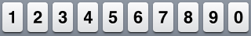

# Passwords

## Description
Pesho has been gifted with the supernatural ability of echolocation. One day he decided to test himself. He knew that his sister's Facebook password consists of digits only and she enters them using these keys: 



So he listened carefully just outside of his sister's room. What he obtained from hearing the typing was:
- The length of the password - **N** (he heard **N** key presses)
- Whether his sister moved her finger **left**, **right** or **kept** it in place in order to press the next key.<br/>E.g. if she pressed key **3** and moved her finger left - the next key can only be either **1** or **2**.

Now he decided to find the **K<sup>th</sup>** possible password of all possibilities in lexicographically ascending order (where **0** is before **1**; **1** is before **2** and so on).

It turns out that his intention is to cheat and use a program. Guess what! He can neither use a computer, nor write code. That is why you have to do his work for him and if you are good enough you might even pass the exam :P

## Input
- The input data should be read from the console.
- A positive integer number is read from the first line - **N**.
- A string of **N-1** symbols is read from the second line - the relations between the typed digits
  - `=` means that the digit is the same as the previous one
  - `<` means that the digit is located to the left of the previous one
  - `>` means that the digit is located to the right of the previous one
- A positive integer number is read from the third line - **K**

## Output
- The output data should be printed on the console.
- On a single line output a string of **N** digits - the **K<sup>th</sup>** password.

## Constraints
- 1 < **N** <= 25
- 0 < **K** <= 2<sup>20</sup>
- For all tests there will be at least one valid password.
- Time limit: **0.1 seconds**
- Memory limit: **32 MB**

## Sample test

### Sample test 1

#### Input
```
10
>>>>>>>>>
1
```

#### Output
```
1234567890
```

#### Explanation
```
There is only one possible password:
1 > 2 > 3 > 4 > 5 > 6 > 7 > 8 > 9 > 0
```

### Sample test 2

#### Input
```
10
<<<<<<<<<
1
```

#### Output
```
0987654321
```

#### Explanation
```
There is only one possible password:
0 < 9 < 8 < 7 < 6 < 5 < 4 < 3 < 2 < 1
```

### Sample test 3

#### Input
```
2
>
13
```

#### Output
```
25
```

#### Explanation
```
Sequence of the first 12 combinations:
10   12   13   14   15   16
17   18   19   20   23   24
The next 8 combinations:
25  <- 13th
26   27   28   29   30   34   35
```

### Sample test 4

#### Input
```
7
<=>>=<
23
```

#### Output
```
0112665
```

#### Explanation
```
0 < 1 = 1 > 2 > 6 = 6 < 5
```
